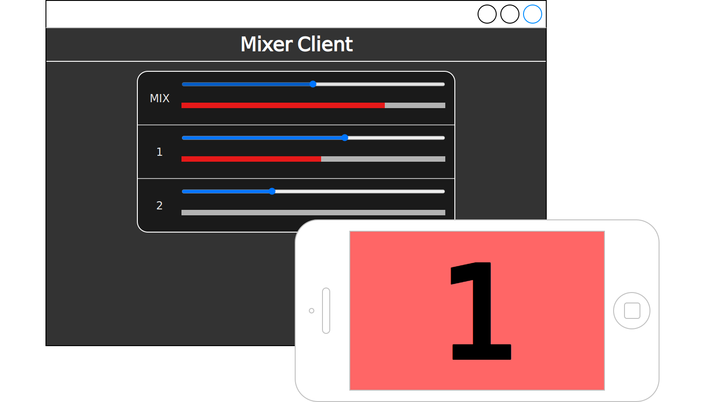
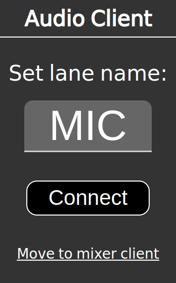
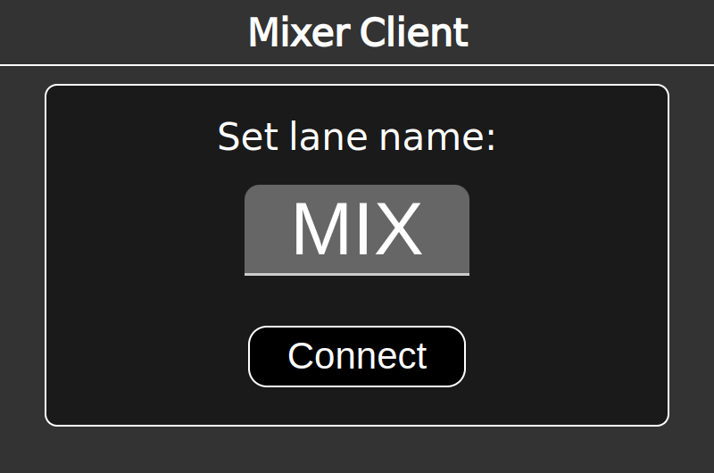
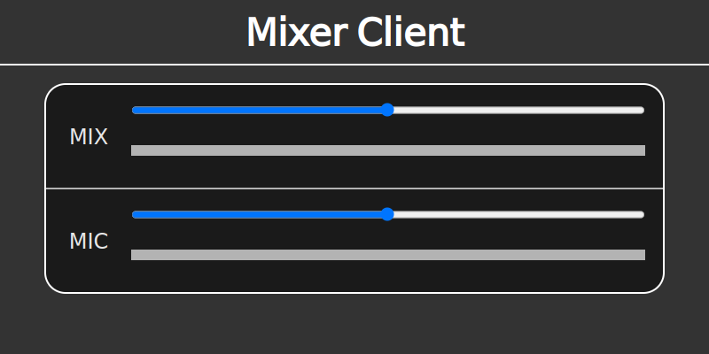

# web-intercom

[](https://github.com/GikenDev/web-intercom/releases) [](https://github.com/GikenDev/web-intercom/blob/main/LICENSE)

Inter-communication system on browser via LAN. Powered by Deno.

ATEM tally light system extended version of [aKuad/web-intercom](https://github.com/aKuad/web-intercom).



## Features

- Multi users talking
  - Required only a browser, additional applications isn't necessary
  - ... means this is cross-platform
- Each user's input volume controlling
  - Also works on browsers
- Easy to setup the server
  - Required only Deno
- Tally light system for ATEM switcher
  - Tally light view on audio client

## Server deployment

As requirements, install [Deno](https://deno.com/) at first.

### Basic run command

Just only run:

```sh
cd src
deno run --allow-net --allow-read --allow-env --allow-ffi main.ts
```

### Enable TLS

> [!NOTE]
>
> For using mic input, secure context is required. It means not working on HTTP, need to be HTTP**S**.

Generate key and certificate for HTTP**S** connection.

> [!CAUTION]
>
> This step generates self signed certificate. Use only in LAN, then **do not open to the Internet**.

```sh
cd src
openssl req -newkey rsa:4096 -x509 -nodes -subj '/CN=common_name_here' -keyout key.pem -out cert.pem
```

> [!NOTE]
>
> `src/main.ts` loads private key from `src/key.pem` and certificate from `src/cert.pem`.

Then run with `--tls` option:

```sh
# on src directory
deno run --allow-net --allow-read --allow-env --allow-ffi main.ts --tls
```

### Enable tally light feature

Run with `--atem-ip="<switcher-IP>"` option, then ATEM connection will be enabled.

```sh
# example for switcher IP is 192.168.0.1
deno run --allow-net --allow-read --allow-env --allow-ffi main.ts --atem-ip="192.168.0.1"
```

## Client usage

### Audio client (Normal mode)

Access to `http(s)://server.address:8000/`

Type lane name, then click 'connect'.



### Audio client (Tally light mode)

When lane name is integer 1~8 at audio client, it turn to tally mode.


### Mixer client

Access to `http(s)://server.address:8000/mixer.html`

Type lane name, then click 'connect'.



Then view all lanes fader and meter. Move fader to control gain of each lane.



## License

[CC0-1.0](https://github.com/aKuad/py-web-intercom/blob/main/LICENSE)
